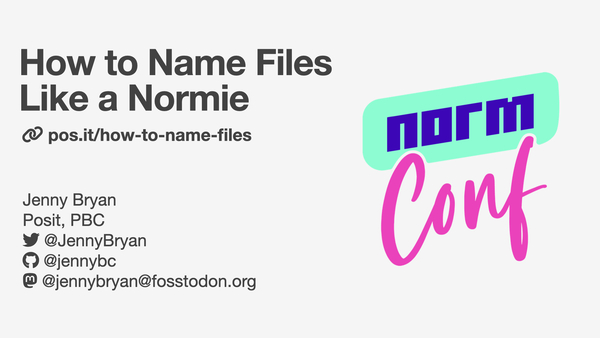

# How to name files

Low-tech common sense about filenames. The holy trinity is:

* machine readable
* human readable
* plays well with default ordering

Lightning talk for <https://normconf.com> 2022-12-15  
by Jenny Bryan  
Twitter: [@jennyBryan](https://twitter.com/JennyBryan)  
Mastodon: [@jennybryan](https://fosstodon.org/@jennybryan)  
GitHub: [@jennybc](https://github.com/jennybc)  

## Link to this repo

[pos.it/how-to-name-files](https://pos.it/how-to-name-files) is a shortlink to HERE

## Slides

<a href="https://speakerdeck.com/jennybc/how-to-name-files-the-sequel"></a>

Slides [on SpeakerDeck](https://speakerdeck.com/jennybc/how-to-name-files-the-sequel)

Slides [as PDF file](how-to-name-files.pdf) here in this repo 

## Video

These lightning talks were pre-recorded. Video is available here:

<https://youtu.be/ES1LTlnpLMk>

A lower-res, downloadable version is here in the repo: [how-to-name-files-480.mov](how-to-name-files-480.mov)

## License

[![CC BY 4.0][cc-by-shield]][cc-by]

This work is licensed under a
[Creative Commons Attribution 4.0 International License][cc-by].

[cc-by]: http://creativecommons.org/licenses/by/4.0/
[cc-by-shield]: https://img.shields.io/badge/License-CC%20BY%204.0-lightgrey.svg

## Credits and resources

Material originated during a Reproducible Science Curriculum Workshop, held at NESCent in December 2014, under the auspices of the Reproducible Science Curriculum <https://github.com/Reproducible-Science-Curriculum>.

The original slides were made for a workshop held at Duke University in May 2015 and were shared at <https://speakerdeck.com/jennybc/how-to-name-files>.

The Jason Bourne (2016) movie really does have some fantastic file names right around the 6 minute mark. Seriously!

A more complete snippet for the tidyverse-y R code I show for converting a list of filenames into a data frame looks more like this

``` r
library(tidyverse)
# note: as of 2022-12-04, separate_wider_delim() is only available in a dev
# version of tidyr, which I have installed locally

filenames <- list.files(pattern = "Plasmid")

tibble(filenames) |>
  separate_wider_delim(
    filenames,
    delim = regex("[_\\.]"),
    names = c("date", "assay", "line", "well", NA)
  )
```

Good discussion of slugs here in the wikipedia page for [clean URLs](https://en.wikipedia.org/wiki/Clean_URL)

Tweet with the "comprehensive map of all countries in the world that use MM-DD-YYY" <https://twitter.com/donohoe/status/597876118688026624>

The [ISO 8601 standard for datetimes](https://en.wikipedia.org/wiki/ISO_8601)

Image credits

* Shoes on pavement: Jon Tyson <https://unsplash.com/photos/PXB7yEM5LVs>
* Concrete background: Yan Ots <https://unsplash.com/photos/UuBR5kbvt4Y>
* Moses and stone tablets: Levi Meir Clancy <https://unsplash.com/photos/c3fNWbbn0VA>
* Arched ceiling: Bruce van Zyl <https://unsplash.com/photos/-MKR972ocbc>
* Slug: Wolfgang Hansemann <https://unsplash.com/photos/dZ-qfkV30GA>
* Stained paper: Annie Spratt <https://unsplash.com/photos/xvU-X0GV9-o>
* Filing drawers: National Cancer Institute <https://unsplash.com/photos/89rul39ox2I>
